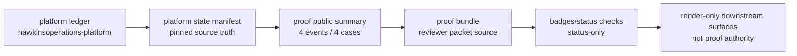

# Reviewer Proof Map

This proof-owned map lets a reviewer inspect the Lifetime Case Ledger proof chain without opening every artifact manually.

It is a reviewer navigation and boundary artifact. It does not promote proof, publish evidence, mutate GitHub Project #1, mutate website, or raise the proof ceiling.

| Field | Current state |
|---|---|
| Owner repo | `hawkinsoperations-proof` |
| Artifact class | proof-owned reviewer map |
| Ledger summary | `proof/records/lifetime-case-ledger-v1-public-summary.json` |
| Proof bundle | `proof/records/lifetime-case-ledger-v1-proof-bundle.json` |
| Ledger count | 4 events / 4 cases |
| Ledger public-safe status | `NOT_PUBLIC_SAFE` |
| Proof ceiling | `SCHEMA_CONTRACT_VERIFIER_EXISTS_ONLY` |
| Correct platform manifest path | `../hawkinsoperations-platform/contracts/lifetime-case-ledger-v1-state-manifest.json` |
| Badges | status-only indicators |
| Website/render surfaces | render-only reviewer routes |
| Project #1 | Project #1 is operating control only |

## Reviewer Click Path

| Order | Start here | Why |
|---|---|---|
| 1 | Start with this map: `proof/indexes/reviewer-proof-map.md` | Read the proof chain, artifact map, blocked claims, and verifier command from one proof-owned reviewer surface. |
| 2 | Check `proof/records/lifetime-case-ledger-v1-public-summary.json` | Confirm the 4 events / 4 cases count spine, `NOT_PUBLIC_SAFE` boundary, and `SCHEMA_CONTRACT_VERIFIER_EXISTS_ONLY` ceiling. |
| 3 | Check `proof/records/lifetime-case-ledger-v1-proof-bundle.json` | Confirm the summary, corrected platform manifest path, verifier commands, reviewer steps, and excluded material. |
| 4 | Run `scripts/verify-reviewer-proof-map.py` | Verify map, Markdown, sibling references, blocked claims, and boundary terms deterministically. |
| 5 | Review the Blocked Claims section | Confirm runtime, signal, public-safe, production, disposition, case closure, website-authority, badge-authority, and Project #1 authority claims remain blocked. |

## Proof Chain Visual



| Stage | Owner | Artifact path | What it proves | What it does not prove | Current status | Proof ceiling |
|---|---|---|---|---|---|---|
| Platform ledger | `hawkinsoperations-platform` | `evidence/autosoc-case-ledger-v0.sqlite` | A platform ledger seed bridge exists for the 4 events / 4 cases count spine. | Runtime, signal, public proof, deployment, disposition, and closure claims remain blocked. | tracked platform seed bridge; ledger remains `NOT_PUBLIC_SAFE` | `SCHEMA_CONTRACT_VERIFIER_EXISTS_ONLY` |
| Platform state manifest | `hawkinsoperations-platform` | `contracts/lifetime-case-ledger-v1-state-manifest.json` | A pinned source manifest records the ledger count state, repo anchors, and proof boundary inputs. | A manifest is source truth only and does not establish runtime, signal, public-safe, or closure authority. | pinned read-only verifier input | `SCHEMA_CONTRACT_VERIFIER_EXISTS_ONLY` |
| Proof public summary | `hawkinsoperations-proof` | `proof/records/lifetime-case-ledger-v1-public-summary.json` | The proof repo owns a bounded public summary for 4 events / 4 cases, zero public-safe cases, and zero closed cases. | The summary is not runtime evidence and does not approve public proof or case disposition. | source-controlled summary; `NOT_PUBLIC_SAFE` | `SCHEMA_CONTRACT_VERIFIER_EXISTS_ONLY` |
| Proof bundle | `hawkinsoperations-proof` | `proof/records/lifetime-case-ledger-v1-proof-bundle.json` | The proof repo packages the summary, pinned manifest reference, verifier commands, reviewer steps, and exclusions. | The bundle is not a release, tag, live evidence export, or public-safe promotion. | reviewer packet source only; no release authority | `SCHEMA_CONTRACT_VERIFIER_EXISTS_ONLY` |
| Badge/status checks | `hawkinsoperations-proof` | `README.md` and Governance Gate workflow status | Badge routes expose workflow status for the ledger summary and proof bundle verifier jobs. | Badges are status-only and cannot authorize proof, publication, deployment, or disposition claims. | badge/status references only; not proof authority | `SCHEMA_CONTRACT_VERIFIER_EXISTS_ONLY` |
| Render-only downstream surfaces | `hawkinsoperations-website` and `.github` | website render routes and GitHub reviewer routing | Downstream surfaces can route reviewers to proof-owned artifacts when separately reviewed. | Render-only and routing surfaces are not proof authority and cannot raise claim ceilings. | render-only or operating-control route; not proof authority | `SCHEMA_CONTRACT_VERIFIER_EXISTS_ONLY` |

## Artifact Map

| Artifact | Owner | Reviewer use | What it proves | What it does not prove |
|---|---|---|---|---|
| `proof/records/lifetime-case-ledger-v1-public-summary.json` | proof | Ledger count summary | 4 events / 4 cases and `NOT_PUBLIC_SAFE` boundary are source-controlled in the proof repo. | Runtime, signal, public-safe runtime, deployment, and closure authority remain blocked. |
| `proof/records/lifetime-case-ledger-v1-proof-bundle.json` | proof | Proof bundle source | Summary, pinned manifest reference, verifier commands, reviewer steps, exclusions, and blocked claims are packaged. | It is not a release, tag, public-safe promotion, or runtime evidence export. |
| `proof/indexes/lifetime-case-ledger-v1-evidence-map.json` | proof | Evidence preservation map | Canonical, verifier, badge/status, render-only, stale, duplicate, and cleanup-candidate classes are explicit. | It performs no move, copy, delete, archive, or proof promotion. |
| `proof/indexes/hawkinsoperations-branch-cleanup-map.json` | proof | Branch cleanup map | Branch records are classification-only and deletion remains approval-gated. | It does not delete branches or declare cleanup safe without approval. |
| `README.md` badge routes | proof | Badge/status route | Workflow status can be checked for ledger summary and bundle verifiers. | Badge as proof authority is blocked; badges are status-only. |
| Website render routes | website | Downstream reviewer route | A website may route reviewers to proof-owned artifacts after separate review. | Website as proof authority is blocked; website remains render-only. |
| GitHub Project #1 | GitHub Project | Private operating control | It may track work and gates privately. | Project #1 as proof authority is blocked; Project #1 is operating control only. |

## Trust Backup Checklist

| Check | Status | Evidence |
|---|---|---|
| Can the summary be verified? | PASS_REVIEWABLE | `scripts/verify-lifetime-ledger-public-summary.py` checks the public summary against the pinned platform manifest. |
| Can the bundle be verified? | PASS_REVIEWABLE | `scripts/verify-lifetime-ledger-proof-bundle.py` checks the proof bundle and reviewer steps. |
| Are badges/status-only? | PASS_REVIEWABLE | `scripts/verify-lifetime-ledger-badges.py` and README wording keep badges status-only. |
| Are evidence maps present? | PASS_REVIEWABLE | `proof/indexes/lifetime-case-ledger-v1-evidence-map.json` and `proof/indexes/hawkinsoperations-branch-cleanup-map.json` exist. |
| Are stale/cleanup candidates classification-only? | PASS_REVIEWABLE | The branch cleanup map keeps deletion approval-gated and records no branch deletion. |
| Are blocked claims explicit? | PASS_REVIEWABLE | The blocked claim table below lists every required blocked claim. |
| Is website/render authority blocked? | PASS_REVIEWABLE | Website/render surfaces are render-only and not proof authority. |
| Is Project #1 proof authority blocked? | PASS_REVIEWABLE | Project #1 is operating control only and not proof authority. |

## Blocked Claims

| Claim | Status | Boundary |
|---|---|---|
| runtime-active public proof | BLOCKED | This map does not prove runtime-active public proof. |
| signal-observed public proof | BLOCKED | This map does not prove signal-observed public proof. |
| public-safe runtime proof | BLOCKED | This map does not prove public-safe runtime proof; ledger status remains `NOT_PUBLIC_SAFE`. |
| production deployment | BLOCKED | This map does not prove production deployment. |
| SOCaaS deployment | BLOCKED | This map does not prove SOCaaS deployment. |
| autonomous SOC | BLOCKED | This map does not prove autonomous SOC authority. |
| AI-approved disposition | BLOCKED | This map does not prove AI-approved disposition. |
| analyst-approved disposition | BLOCKED | This map does not prove analyst-approved disposition. |
| case closure | BLOCKED | This map does not prove case closure; closed-case count remains zero. |
| Cribl-routed | BLOCKED | This map does not prove Cribl-routed telemetry or public proof. |
| Wazuh-routed | BLOCKED | This map does not prove Wazuh-routed telemetry or public proof. |
| AWS-live | BLOCKED | This map does not prove AWS-live runtime state. |
| fleet-wide | BLOCKED | This map does not prove fleet-wide coverage. |
| live Splunk firing | BLOCKED | This map does not prove live Splunk firing. |
| website as proof authority | BLOCKED | Website/render surfaces are not proof authority. |
| badge as proof authority | BLOCKED | Badges are status-only and not proof authority. |
| Project #1 as proof authority | BLOCKED | Project #1 is operating control only and not proof authority. |

## Verifier

Run:

```powershell
python scripts/verify-reviewer-proof-map.py --platform-root ../hawkinsoperations-platform --github-root ../.github
```

The verifier checks that this map exists, required artifact references exist, 4 events / 4 cases remain present, `NOT_PUBLIC_SAFE` remains present, `SCHEMA_CONTRACT_VERIFIER_EXISTS_ONLY` remains present, blocked claims remain blocked, badges remain status-only, website/render surfaces remain render-only, and Project #1 remains operating control only.
